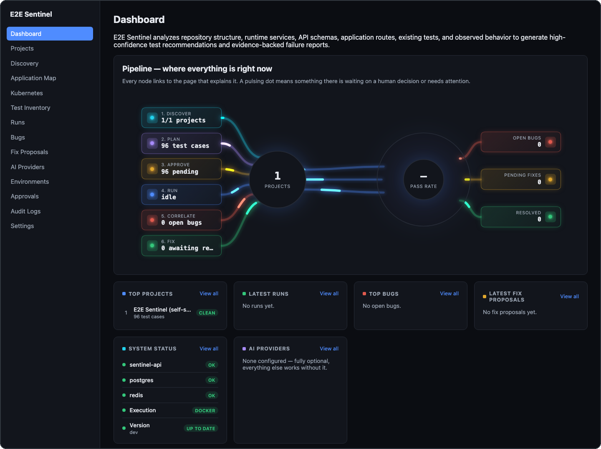

# Tolgahan Ayaz
**DevOps Engineer · Backend Engineer** — Turkey

### Tech Stack

### Flagship Project

**[E2E Sentinel](https://github.com/Tolgahan0/E2E-Sentinel)** — a self-hosted, AI-assisted quality
engineering platform. It scans a repository and its runtime architecture, produces a reviewable
test inventory and risk-based E2E test plan, executes tests in isolated disposable containers,
correlates failures across layers, and proposes fixes as reviewable diffs — never touching source
code, infrastructure, or data without explicit human approval.

  

### GitHub Activity

<picture>
  <source media="(prefers-color-scheme: dark)" srcset="https://raw.githubusercontent.com/Tolgahan0/Tolgahan0/output/github-contribution-grid-snake-dark.svg" />
  <source media="(prefers-color-scheme: light)" srcset="https://raw.githubusercontent.com/Tolgahan0/Tolgahan0/output/github-contribution-grid-snake.svg" />
  
</picture>

